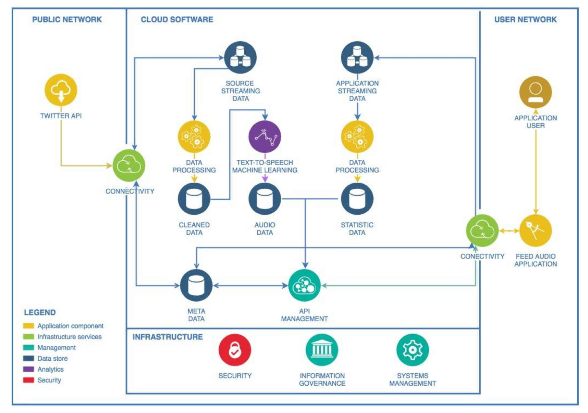
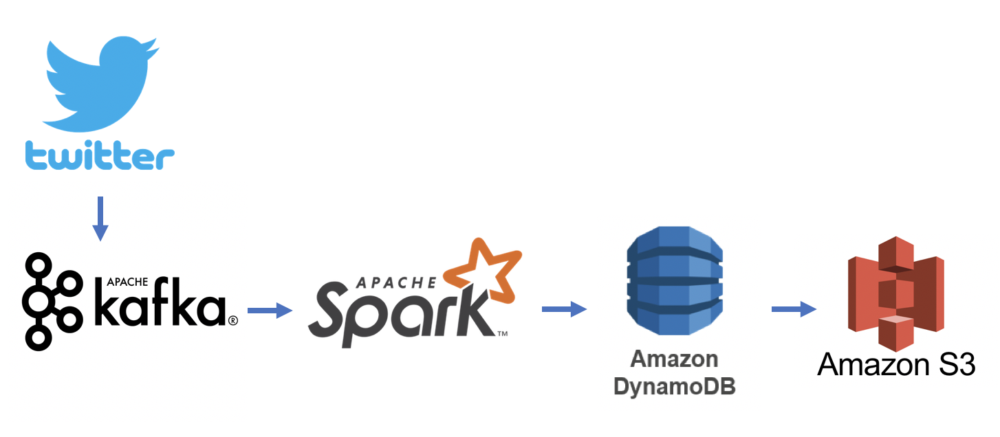

# Twitter Feed Audio Player

## Idea:
**Imagine that you are driving and want to listen to a personalized radio.**

Create a mobile phone application that tells you political, social, geeky stories that your friends have posted via audio or a facebook news paper.

Cloud angle: browser your friends feeds, gather links
posted by them, group them into topics, covert them into
audio headlines (or news paper feed)

## Project Proposal:
Social media produces a huge amount of information in modern society. People use social media to receive messages from their friends, followed celebrities and public organizations. However, people nowadays do not usually have enough time for all the blast of information, or rather they cannot digest the most essence of every day information. Since the trend of this era is all about massive data, we want to build a cloud application that can not only help us digest the most of every day information across all the social media platforms, but also reduce the size of the information to the most important, outstanding, and maybe interesting ones. Even further, we propose our application to have extra accessibility feature, which enable our users to listen to the stories and news happened on their social media accounts. 

We think that being able to produce audible information from written text is the ultimate convenience for such information extraction application. In order to leverage most leisure time when reading is impractical; i.e., driving, riding packed subways, our users can simply put on headphone and skim through all the summaries of their daily social broadcast. 

On the technical side, such project demands good setups for data mining and machine learning as well as cloud computing architecture as the overall backbone. We need to ensure intact information scrapping, accurate data classification, and understandable text summarization.

## Architecture:

## Data Flow:

## Team:

- Lizi Chen: lc3397@nyu.edu
- Haoran Ma: hm1651@nyu.edu
- Le Wang: lw2341@nyu.edu
- Chun-Yi Yang: cyy292@nyu.edu

## Presentation File:

[Presentation File](https://github.com/Scalable-NYU/Aggregated-Feed-Audio-Player/blob/master/Final_Presentation.pdf)

## Resource:

- https://sysadmins.co.za/interfacing-amazon-dynamodb-with-python-using-boto3/  
- https://docs.aws.amazon.com/amazondynamodb/latest/developerguide/GettingStarted.Python.02.html  
- https://www.datasciencebytes.com/bytes/2015/02/28/using-flask-to-answer-sql-queries/  
- https://www.datasciencebytes.com/bytes/2015/02/24/running-a-flask-app-on-aws-ec2/  
